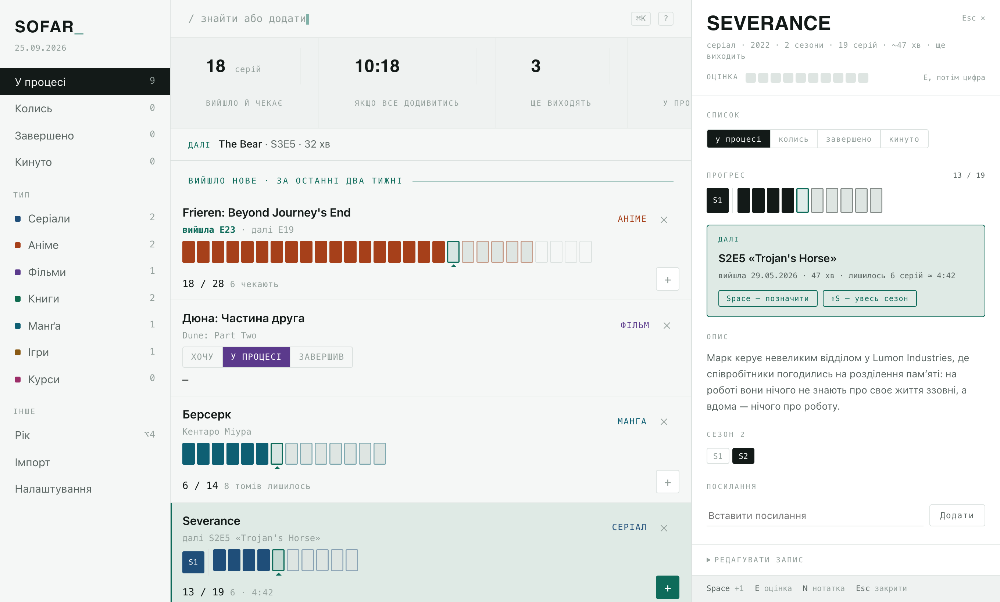
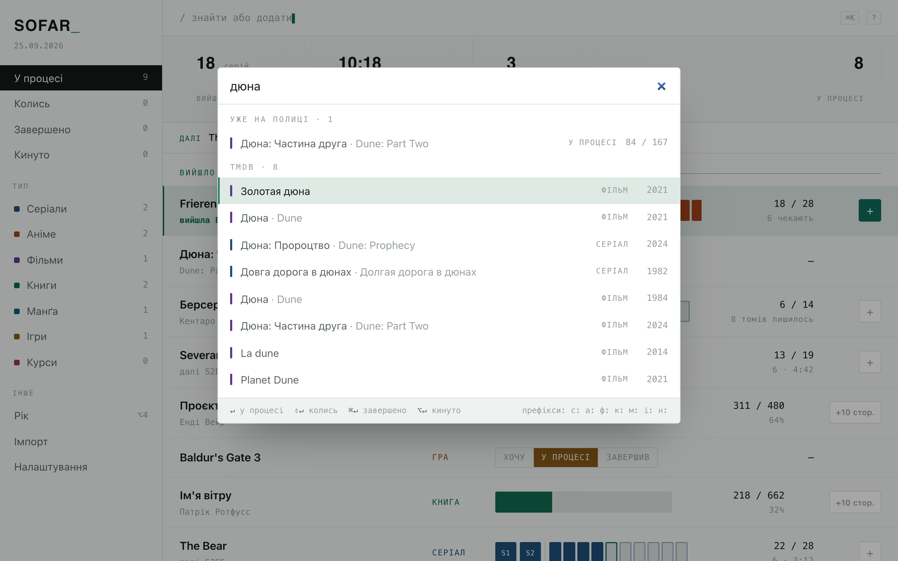
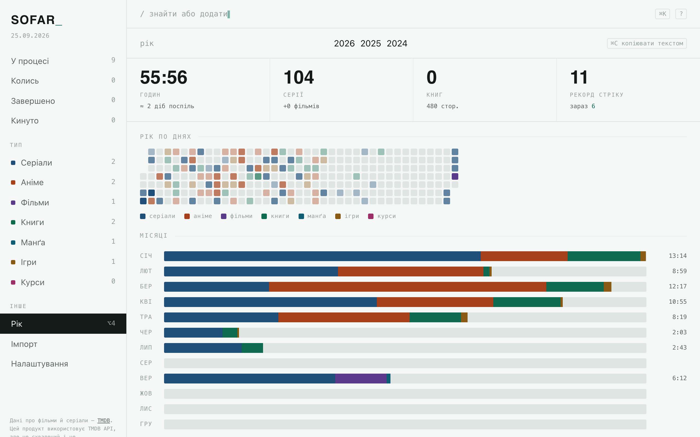
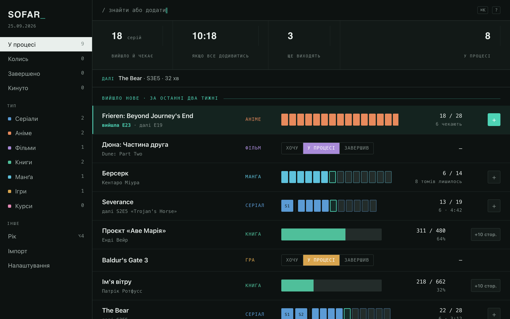

# Sofar

A personal media tracker for one person: series, anime, films, books, manga,
games and courses on one shelf, with progress down to the episode, the page
or the minute you stopped at.

Self-hosted, server-rendered, single binary. Go + htmx + SQLite. The
interface is Ukrainian.


## Why it exists

Every tracker answers "have you seen it?". Sofar answers the evening
question: **what is waiting for me, and where did I stop?** The first thing on
the screen is how many episodes have aired that you have not watched, how long
they would take, and which one to start with. The list below shows progress as
a shape you read before you read the title.

It is built for a phone at 23:40 and a keyboard the rest of the time, and it
keeps its data in one file you can copy.

## How it looks

### The track

Each cell is one episode. Filled means watched; the outlined cell with a caret
is next; a coloured outline means it has aired and is waiting; an empty outline
is not out yet. That last distinction is what a progress bar cannot show, and it
comes for free from air dates.

Seasons collapse: finished ones become a block, the season you are in keeps
full-size cells, later ones wait as outlines. Every block is the same width —
a width you cannot count episodes from is noise. Click any cell to set your
position there; click a block to open that season in the panel.

Books and films get a bar you can click the same way. Manga gets one cell per
volume. Anything you only want to track by status gets three buttons instead.

### The panel



`↵` or a click on the title opens it. Rating, which list the entry is on,
the full track with season tabs, what to watch next and how long is left,
the description, links to where you watch it, a note, and an edit form folded
at the bottom.

### Adding



`⌘K` is one field. It searches your own shelf first, then the catalog. A
prefix narrows the type: `с:` series, `а:` anime, `ф:` films, `к:` books,
`м:` manga, `і:` games, `н:` courses. `↵` adds to «у процесі», `⇧↵` to
«колись», `⌘↵` to «завершено» and keeps the field open — that is how an archive
gets typed in.

A series with several seasons asks *season and episode*, not an absolute
number. A book arrives as a prefilled form, because the catalog's page count
belongs to some edition, not necessarily yours. Manga is searched in a
Ukrainian shop rather than a catalog, so the result is what is actually
printed here.

### The year



Everything here derives from the progress log. Nothing is entered by hand.
Positions you declared when adding a title do not count — that is setup, not
watching.

### On a phone

Add it to the home screen and it opens as an app. Same pages, same CSS:
figures in two columns, one thumb-sized button per row, the four lists in a
tab bar. There is no service worker on purpose — a list that could be stale
is worse than one that says it cannot load.

Both themes follow the system; **Налаштування** can pin one.



## What it does

- **Seven kinds**, each with its own unit: episodes, minutes, pages, volumes,
  hours, lessons. Per-kind step (`+1`, `+10 стор.`) and depth (units or
  status only) in settings.
- **Catalogs fill in metadata, never define progress.** TMDB for films and
  series (with Japanese animation detected as anime, films included), Google
  Books, RAWG for games, ComicsMania for Ukrainian manga. Every catalog is
  optional; the manual form always works.
- **What aired.** Shows with a new episode in the last two weeks move to
  «Вийшло нове». A nightly job re-imports running shows, so episodes appear
  on their own.
- **Manga watch.** Follow a series and the nightly job asks the shop whether a
  new volume is on sale; when the number grows past your position the row says
  «вийшов том N» with a link.
- **Undo everything.** Progress is an append-only log; `⌘Z` reverses the last
  move, deleting is soft and restorable from the toast.
- **Import and export.** Paste a list of titles and TMDB matches them, with a
  year in brackets to disambiguate. `/export` dumps the whole shelf as JSON.
- **Backups.** Every night a `VACUUM INTO` copy lands beside the database,
  newest fourteen kept. **Налаштування → Резервна копія** downloads the latest;
  once a month, carry it off the box.
- **One password.** No accounts. A year-long cookie signed with a key derived
  from the password, so changing it logs every device out. The server refuses
  to start on a public address without one.

## Keyboard

| Key | Action |
|---|---|
| `↑` `↓` | select a row |
| `Space` | advance by the type's step; `3 Space` advances by three |
| `⇧Space` | back one |
| `⇧S` | to the end of the current season |
| `↵` | open or close the panel |
| `E` then `1`–`9` | rate, `0` is ten |
| `N` | note in the open panel |
| `O` | open the entry's link |
| `⌘⌫` | drop |
| `⌘Z` | undo |
| `⌘K` | search or add |
| `⌥1`–`⌥4` | у процесі · колись · завершено · рік |
| `?` | this list |

Shortcuts match the physical key as well as the letter, so a Ukrainian layout
works without switching. Page shortcuts sit on `⌥` because Chrome keeps
`⌘1`–`⌘9` for its own tabs.

## Run

```bash
go run .                 # sofar.db in the working directory, listens on :8099
SOFAR_DEV=1 go run .     # templates from disk, seven sample entries on an empty db
go test ./...
```

Dev mode reloads templates but not Go code — restart after Go changes.
`SOFAR_FIXTURES=0` keeps an empty database empty. [TESTING.md](TESTING.md) is
the manual pass before a deploy.

### Configuration

Environment first, then `.env` in the working directory.

| Variable | Default | |
|---|---|---|
| `SOFAR_ADDR` | `:8099` | listen address |
| `SOFAR_DB` | `sofar.db` | the SQLite file |
| `SOFAR_PASSWORD` | — | **required** unless dev or loopback |
| `TMDB_TOKEN` | — | v4 read token; films and series |
| `GOOGLE_BOOKS_KEY` | — | books |
| `RAWG_KEY` | — | games |
| `SOFAR_BACKUPS` | `backups` beside the db | nightly copies |
| `SOFAR_CACHE` | `cache` | catalog responses on disk |
| `SOFAR_TZ` | `Europe/Kyiv` | |
| `SOFAR_DAY_START` | `4` | a day starts at 04:00: an episode at 01:30 belongs to the evening before |
| `SOFAR_DEV`, `SOFAR_FIXTURES`, `SOFAR_ENV_FILE` | | see above |

### Deploy

```bash
docker compose up --build
```

Multi-stage build into distroless, `CGO_ENABLED=0`, runs as nonroot, state on
a `/data` volume — about 14 MB and one dependency (`modernc.org/sqlite`, pure
Go). The image has no shell, so the binary checks its own `/healthz` for the
compose healthcheck. On Dokploy it is a Compose application: join
`dokploy-network`, add the domain in the Domains tab (service `sofar`, port
`8080`), put the keys in Environment. A push to `main` deploys.

## How it is built

```
main.go              config, database, server, graceful shutdown
internal/config      environment, .env, the 04:00 day boundary
internal/domain      tracks, units, statistics — no I/O
internal/store       SQLite and every query — no HTML, no network
internal/catalog     TMDB, Google Books, RAWG, ComicsMania
internal/nightly     refresh shows, poll manga, purge, backup
internal/server      routes, handlers, templates, one app.css, keys.js
```

Three invariants hold everything together. `progress` is an append-only log
and the source of truth; `entry.position` is a cache of it. `unit.idx` runs
1..N across all seasons, so a position is one integer. Deletion is soft.

Every POST answers with an HTML fragment; there is no JSON API. No frontend
build, no router, no ORM. Comments explain *why*. Settled decisions and their
reasons are in [PLAN.md](PLAN.md); conventions for working in the repo are in
[AGENTS.md](AGENTS.md).

## Attribution

This product uses the TMDB API but is not endorsed or certified by TMDB. Game
data comes from RAWG, book data from Google Books, Ukrainian manga listings
from ComicsMania.
